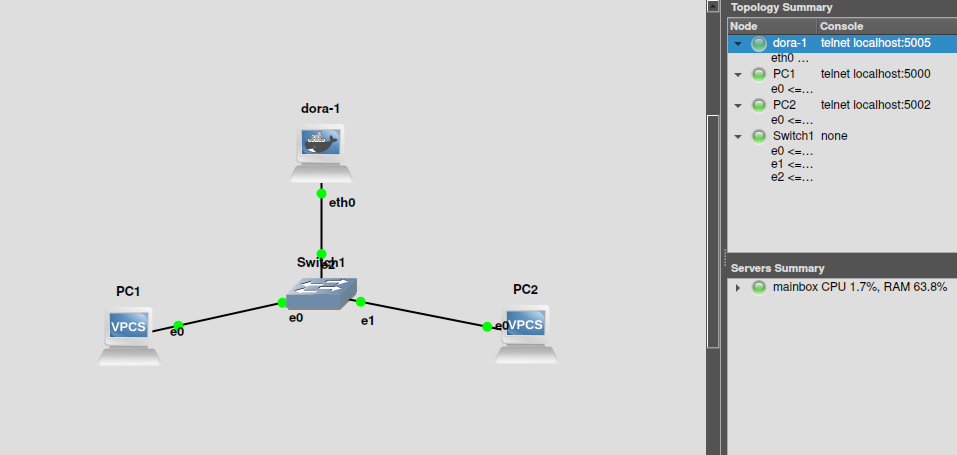
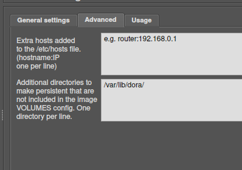

# Running dora in GNS3

GNS3 is used to emulate virtual networks on a single machine. It has a nice GUI interface where you can drag & drop virtual machines and set them up in different network topologies.

You can get instructions to download it here.

It also supports docker containers, so you can run dora connected to the virtual nodes and test DHCP.



## Setup

-   install gns3

-   clone the dora github repo https://github.com/bluecatengineering/dora

-   follow the instructions in `docs/docker.md` to create a dora docker image

-   In gns3 click `Preferences > Docker > Docker Containers > New`

-   Select the dora image from the list, for “start command” you can put `sh` to start a shell if you plan to start dora manually, otherwise you can put `DORA_LOG="debug" dora`

-   Under the “Advanced” tab, there is a box to add VOLUMES to the image. Add `/var/lib/dora/` as a volume like this:



(this will create a `/var/lib/dora/` dir in the GNS3 project `~/GNS3/projects/${PROJECT_NAME}/project-files/docker/<hash>/var/lib/dora/`

-   Add the dora docker image to gns3

-   In the main view, drag the newly created dora docker image into your network template

-   Right click on it and select “show in file manager” then navigate to the `/var/lib/dora/` dir (you may have to start it once for this to be created, or create it manually)

-   Add a config.yaml into this dir. This config will be volume-mounted into dora. The leases.db will also be persisted here between runs.

-   Right click on the dora image again and select “Edit config”. Here you can to give a static IP to eth0 so that dora will listen and respond on a specific interface and subnet. The subnet must match the subnet you are serving in the config.yaml

## Example configs for dora

Under "Edit Config" for dora node:

```
auto eth0
iface eth0 inet static
address 192.168.5.1
netmask 255.255.255.0
gateway 192.168.5.1
up echo nameserver 192.168.5.1 > /etc/resolv.conf
```

with config.yaml:

```
networks:
    192.168.5.0/24:
        authoritative: true
        probation_period: 86400
        ranges:
            -
                start: 192.168.5.2
                end: 192.168.5.250
                config:
                    lease_time:
                        default: 3600
                        min: 1200
                        max: 4800
                options:
                    values:
                        subnet_mask:
                            type: ip
                            value: 255.255.255.0
                        routers:
                            type: ip
                            value:
                                - 192.168.5.1
                        domain_name_servers:
                            type: ip
                            value:
                                - 8.8.8.8
                        broadcast_addr:
                           type: ip
                           value: 192.168.5.255

```

Now create your network configuration, and start all the nodes. You can then open a console in the dora docker container and run dora if you don’t have it set to run manually, then in the console of the VPCS nodes run `ip dhcp` to get an IP address. You can edit the VPCS nodes to automatically use DHCP on boot also.
